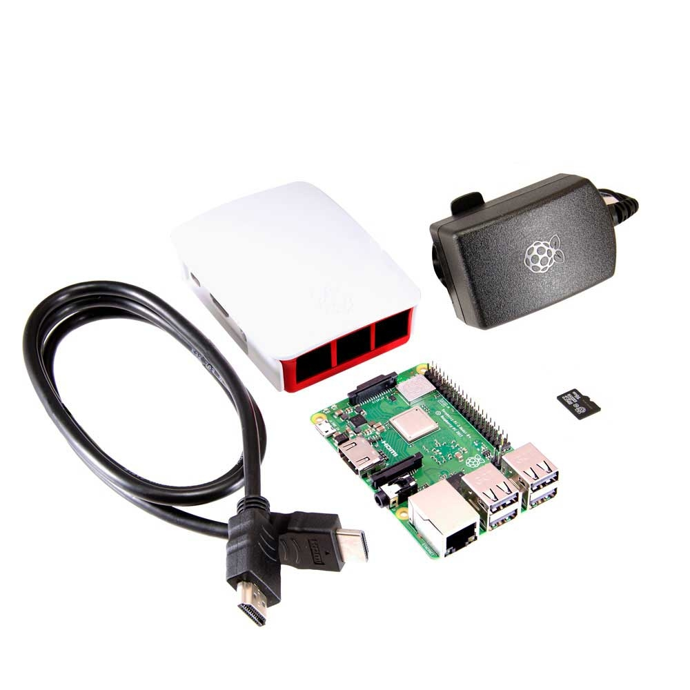

# TwoFactorPi
Using your Raspberry Pi as a hardware security key for two-factor authentication

### You will need
- Raspberry Pi kit



- 3.5inch TFT Touchscreen Dispaly


### Getting Started

#### Prerequisites
You will need to setup Raspberry Pi with `Raspbian` distribution and have remote access via SSH/vnc

If your screen is showing up as blank white you will need to install the TFT display drivers

Make sure `nodejs` and `npm` is installed by running `node -v` and `npm -v` respectively

#### 1. Clone and install dependencies

```
git clone https://github.com/SkyTradeInc/Two-Factor-Authentication.git
cd Two-Factor-Authentication
npm i
```

#### 2. Configure
Create a file named `secrets.json`. This will contain our back-up secrets we receive when enabling two factor authentication

*Example configuration file*
```
[
  {
    "website": "Google",
    "secret": "KNPHN3Q6IK5X9ZPY",
    "email": "example@gmail.com"
  },
  {
    "website": "Github",
    "secret": "CRDJ6INNLA5CAMPP",
    "email": "example@gmail.com"
  }
]
```

### 3. Load on boot

We will need to tell the Pi to start the NodeJS application on boot

```
sudo nano /etc/rc.local
```

Add this on the line before `exit 0`

`sudo nodejs /home/pi/Two-Factor-Authentication/index`

We will also need to tell the Pi to start the browser in full screen on boot

```
sudo nano /home/pi/.config/lxsession/LXDE-pi/autostart
```
Add the following lines
```
@xset s off
@xset -dpms
@xset s noblank
@chromium-browser --kiosk http://127.0.0.1:6060
```

### 4. Test
```
sudo reboot
```

A few seconds after your Raspberry Pi reboots you will be displayed the dashboard

#### Troubleshooting

If you get **This site can't be reached** in your browser, there was an error with your configuration file `secrets.json`, make sure it's valid JSON
